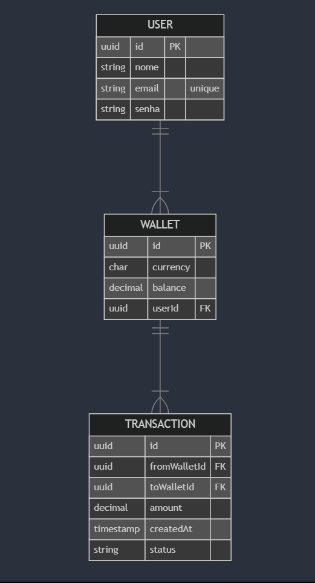

# Carteira API

A **Carteira API** é uma aplicação que simula transferências seguras entre usuários. Com ela, é possível realizar transferências, estornos e visualizar o histórico de transações.

## Tecnologias Utilizadas

- **NestJS** – Framework backend
- **PostgreSQL** – Banco de dados relacional (utilizando TypeORM)
- **TypeORM** – ORM para manipulação do banco de dados
- **Docker** – Facilita o deploy e o desenvolvimento local

## Deploy

A API está disponível no Render:  
[https://carteira-api.onrender.com](https://carteira-api.onrender.com)

A documentação Swagger da API pode ser acessada em:  
[https://carteira-api.onrender.com/api](https://carteira-api.onrender.com/api)

## Diagrama ER



Como o foco o foco são as transferencias, os users criados automaticamente ganham 1000 reais e 1000 dolares em suas respectivas wallets para testar. O user não pode criar wallets diretamente atráves de alguma rota.
As transferencias tem 3 estados
- Successful - Acontece quando uma transferencia foi concluida normalmente e o user que fez o pagamento não pediu estorno. O usuário pode solicitar o estorno da transação dentro de um prazo de 7 dias.
- Reversed  - O usuário recebeu seu estorno e não podem ocorrer mais alterações nessa transação
- Reversed_failed - Acontece quando o destinatário não possuí saldo o suficiente. Dentro desse estado não se tem mais a limitação de tempo e o usuário pode pedir quantas vezes quiser até o destinatário ter saldo.

## Concorrência e Transações Atômicas  

As operações de transferência e estorno são atômicas, garantindo que cada transação ocorra completamente ou seja completamente revertida em caso de falha.

- Foi utilizado o **TypeORM** com **QueryRunner** para fazer as transações de forma atômica  
- **Locks pessimistas** foram aplicadas nas carteiras durante as operações para evitar condições de corrida.  
- Em caso de falha, a transação é **desfeita automaticamente** (`rollback`).  

Isso assegura que **nenhuma transferência seja parcial ou inconsistente**, mesmo com múltiplas transações concorrentes.  


## Como Executar o Projeto

### Com Docker

1. Clone este repositório:
   ```bash
   git clone https://github.com/caiovalverde20/carteira-api.git
   cd carteira-api
   ```

2. (Opcional) Crie um arquivo `.env` na raiz do projeto com as variáveis de ambiente necessárias:
   ```env
   DB_HOST=localhost
   DB_PORT=5432
   DB_USER=seu_usuario
   DB_PASS=sua_senha
   DB_NAME=carteiradb
   JWT_SECRET=secret
   NODE_ENV=development
   PORT=3000
   ```

3. Construa e inicie os containers:
   ```bash
   docker-compose up --build
   ```

4. As tabelas serão criadas automaticamente (utilizando `synchronize: true` em ambiente de desenvolvimento).  
   Acesse a API em: [http://localhost:3000](http://localhost:3000) ou [http://localhost:3000/api](http://localhost:3000/api) para ir direto para a documentação do swagger

### Sem Docker

1. Clone este repositório:
   ```bash
   git clone https://github.com/caiovalverde20/carteira-api.git
   cd carteira-api
   ```

2. Instale as dependências:
   ```bash
   npm install
   ```

3. Crie um arquivo `.env` na raiz do projeto com as variáveis de ambiente:
   ```env
   DB_HOST=localhost
   DB_PORT=5432
   DB_USER=seu_usuario
   DB_PASS=sua_senha
   DB_NAME=carteiradb
   JWT_SECRET=secret
   NODE_ENV=development
   PORT=3000
   ```

4. Compile o projeto:
   ```bash
   npm run build
   ```

5. Inicie a aplicação:
   ```bash
   npm run start:prod
   ```

6. Acesse a API em: [http://localhost:3000](http://localhost:3000) ou [http://localhost:3000/api](http://localhost:3000/api) para ir direto para a documentação do swagger

## Endpoints Principais

- **Transferência**: `POST /transactions/transfer`  
  Realiza uma transferência entre carteiras.

- **Estorno**: `POST /transactions/refund`  
  Solicita o estorno de uma transação realizada em até 7 dias. Se o destinatário não tiver saldo suficiente, o estorno falha, mas pode ser tentado novamente a qualquer momento.

- **Histórico**: `GET /transactions/history`  
  Retorna o histórico de transações do usuário.

